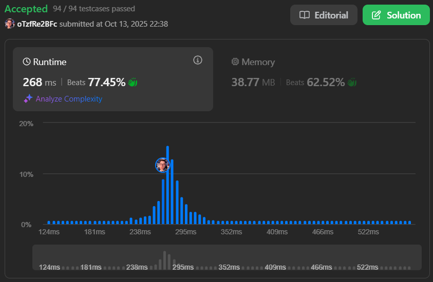
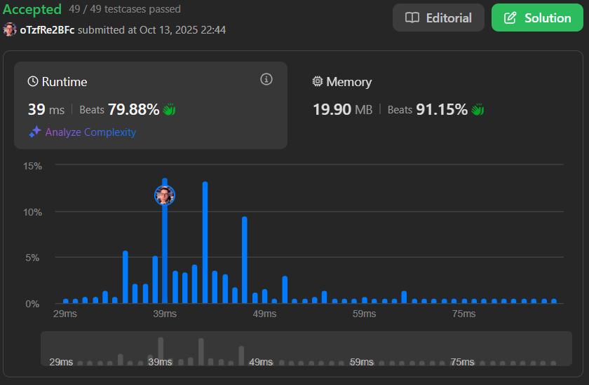
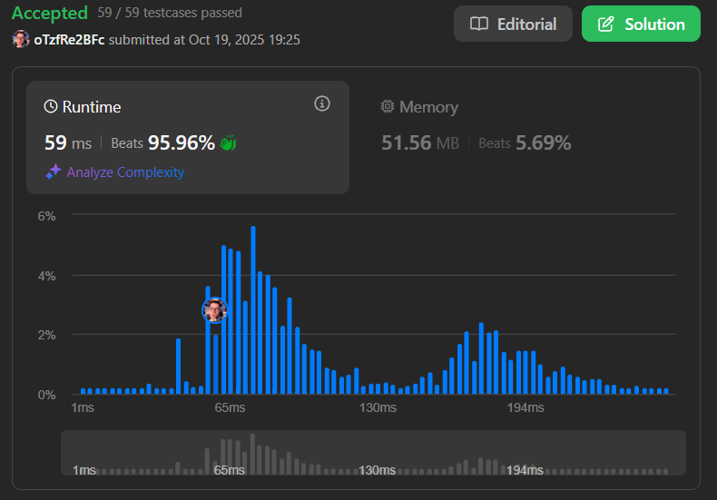

# Algoritmos Ambiciosos - LeetCode

**Conteúdo da Disciplina**: Algoritmos Ambiciosos (Greedy)

## Aluno
| Matrícula    | Aluno                           |
| ------------ | ------------------------------ |
| 21/1041221   | LUAN MATEUS CESAR DUARTE       |

## Sobre

Este diretório reúne soluções para problemas de algoritmos ambiciosos (Greedy) disponíveis na plataforma LeetCode. O objetivo é aplicar estratégias gananciosas para resolver desafios clássicos, evidenciando o entendimento dos conceitos e técnicas estudados.

## Resumo dos Exercícios

### Exercício 632: Smallest Range Covering Elements from K Lists
Neste exercício, o objetivo é encontrar o menor intervalo que contenha pelo menos um número de cada uma das listas fornecidas. A solução utiliza heap para manter o menor intervalo possível durante a iteração.

Arquivo: `632.py`

Link para submissão: [LeetCode - 632](https://leetcode.com/problems/smallest-range-covering-elements-from-k-lists/submissions/1806270992)

---

### Exercício 857: Minimum Cost to Hire K Workers
Neste exercício, o objetivo é encontrar o custo mínimo para contratar K trabalhadores, levando em consideração a qualidade e o salário de cada um. A solução utiliza uma abordagem de heap para gerenciar a qualidade total dos trabalhadores contratados.

Arquivo: `857.py`

Link para submissão: [LeetCode - 857](https://leetcode.com/problems/minimum-cost-to-hire-k-workers/submissions/1806270975)

---

### Exercício 435: Erase Overlapping Intervals
Neste exercício, o objetivo é encontrar o número mínimo de intervalos a serem removidos para que os restantes não se sobreponham. A solução utiliza uma abordagem gananciosa para selecionar os intervalos que não se sobrepõem.

Arquivo: `435.py`

Link para submissão: [LeetCode - 435](https://leetcode.com/problems/non-overlapping-intervals/submissions/1806269063)

---

## Vídeos Explicativos

Link do vídeo no OneDrive: [Vídeo Explicativo](https://unbbr-my.sharepoint.com/:v:/g/personal/211041221_aluno_unb_br/EbjIl9HbaJBPimK0hy1p9NYB80Sy6JicYHNFZzz8Ubs5_w?e=xb4XZa&nav=eyJyZWZlcnJhbEluZm8iOnsicmVmZXJyYWxBcHAiOiJTdHJlYW1XZWJBcHAiLCJyZWZlcnJhbFZpZXciOiJTaGFyZURpYWxvZy1MaW5rIiwicmVmZXJyYWxBcHBQbGF0Zm9ybSI6IldlYiIsInJlZmVycmFsTW9kZSI6InZpZXcifX0%3D)

## Linguagem Utilizada
Python
